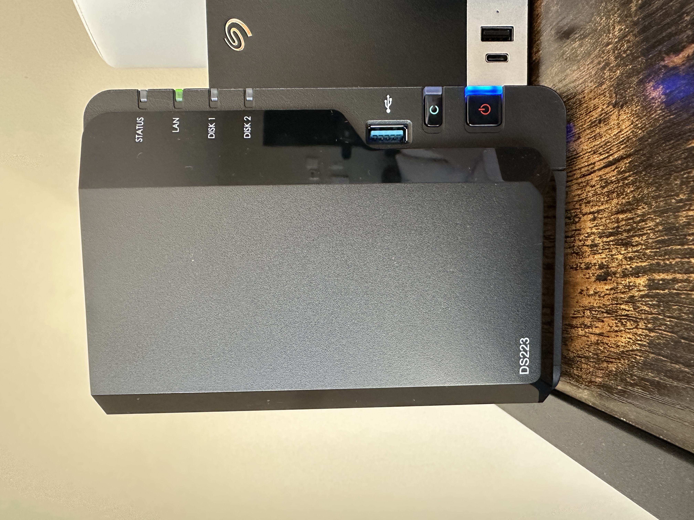
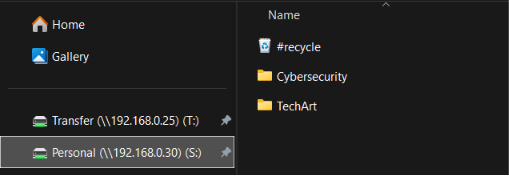
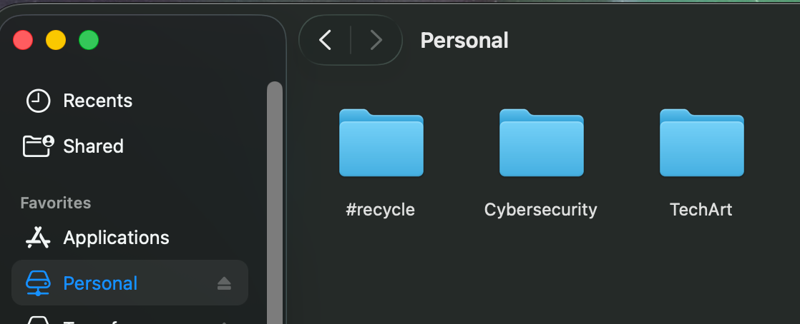
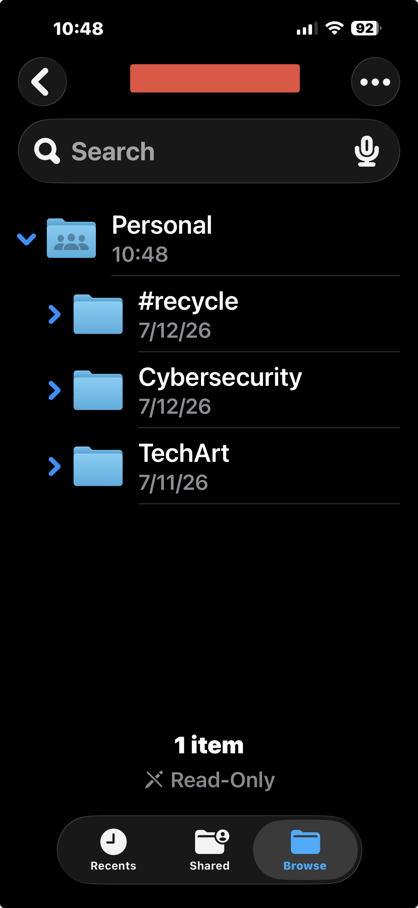

<h1 align="center">Synology NAS Personal Cloud</h1>

<p align="center">
  A secure, cross-platform personal cloud and shared-storage deployment built with a two-bay Synology NAS, a NAS-rated hard drive, and a managed home network.
</p>

<p align="center">
 
</p>

<p align="center">
  
  
  
  
  
</p>

## Access Gallery

| Windows OS | Mac OS | iPhone
|----------------------|-----------------------|-----------------------|
|  |  |  

This project demonstrates storage deployment, network integration, account hardening, SMB configuration, remote access, health monitoring, configuration backup, and recovery planning.

> All hostnames, IP addresses, usernames, remote-access identifiers, and topology details in this public repository are sanitized examples.

## Project Goals

- Create a local alternative to consumer cloud storage
- Provide shared file access for Windows and macOS
- Support secure mobile and remote access
- Separate administrative and everyday user accounts
- Use modern SMB protocols
- Monitor drive and storage health
- Maintain configuration backups
- Prepare for versioned data backups and restore testing
- Keep personal storage separate from cybersecurity lab systems

## Architecture

```text
Internet
   |
ISP Gateway
   |
Managed Security Gateway
   |
Managed Switch
   |
   +-- Synology NAS
   |
   +-- Network Utility Server
   |
   +-- Management Controller
   |
   +-- Windows Workstation
   |
   +-- macOS Workstation
```

## Environment

| Component | Sanitized example |
|---|---|
| NAS | [Two-bay Synology NAS](amazon.com/dp/B0BRNBVTJK?ref_=ppx_hzsearch_conn_dt_b_fed_asin_title_2) |
| Internal drive | [4 TB NAS-rated SATA HDD](https://www.amazon.com/dp/B08VH8C3WZ?ref=ppx_yo2ov_dt_b_fed_asin_title&th=1) |
| Storage pool | Synology Hybrid RAID |
| Volume | Single DSM volume |
| Network | Managed trusted LAN |
| NAS hostname | `nas-storage-device-01` |
| NAS address | `192.168.50.30` |
| Administrator | `nasadminid` |
| Standard user | `nasuserid` |
| Shared folder | `Personal` |

## Implemented Controls

- Reserved DHCP address
- Separate administrator and standard accounts
- Administrator multi-factor authentication
- Built-in administrator disabled
- Guest account disabled
- Auto Block and Account Protection
- SMB1 disabled
- SMB2 minimum and SMB3 maximum
- No direct SMB or DSM port forwarding
- Secure remote access through QuickConnect
- Scheduled S.M.A.R.T. testing
- Scheduled data scrubbing
- Email notifications
- Manual and automatic DSM configuration backup
- Minimal package footprint

## Validation

| Test | Result |
|---|---|
| NAS discovery and DSM installation | Passed |
| Storage pool and volume creation | Passed |
| Initial drive check | Passed |
| Reserved network address | Passed |
| Windows SMB access | Passed |
| macOS SMB access | Passed |
| Cross-platform file visibility | Passed |
| Standard-user permissions | Passed |
| Remote access | Passed |
| Notification test | Passed |
| Configuration backup | Passed |
| Dedicated versioned data backup | Pending |

## Documentation

- [Complete Setup Guide](docs/01-setup.md)
- [Validation and Troubleshooting](docs/02-troubleshooting.md)
- [Security and Best Practices](docs/03-security-and-best-practices)
- [Backup and Recovery Roadmap](docs/04-backup-roadmap.md)

## Current Limitation

The current public example uses a single-drive storage pool.

```text
One drive failure = storage unavailable
```

A second compatible drive can later add one-drive fault tolerance. RAID improves availability, but it does not replace backup.

## Planned Next Phase

- Add a dedicated external backup drive
- Install Hyper Backup
- Configure versioned backups
- Enable backup rotation
- Schedule integrity checks
- Test file restoration
- Document the recovery workflow

## Security Notice

This repository intentionally excludes:

- Production IP addresses
- Real usernames
- QuickConnect identifiers
- Email addresses
- MAC addresses
- Serial numbers
- Screenshots containing sensitive infrastructure details
- Credentials, recovery codes, and encryption keys
